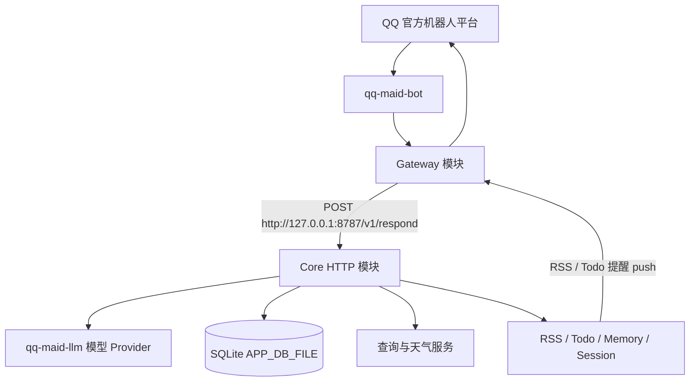

# QQ Maid Bot

[](CONTRIBUTING.md)
[](https://github.com/kuliantnt/qq-maid-bot/stargazers)

一个使用 Rust 构建的 QQ 官方 AI 机器人，集成聊天、会话、长期记忆、待办、RSS / Atom 订阅、查询、天气和主动推送能力，适合搭建属于自己的长期在线 QQ 助手。

## git clone 后本地部署

```bash
git clone https://github.com/kuliantnt/qq-maid-bot.git
cd qq-maid-bot

cp runtime/.env.example runtime/config/.env
# 编辑 runtime/config/.env，填写 QQ 官方机器人、模型 provider、天气等必要配置
vim runtime/config/.env

bash scripts/deploy-local.sh
```

`deploy-local.sh` 会构建统一 `qq-maid-bot` release 二进制、安装到 `runtime/` 并自动重启服务。日常更新代码后也只需重新执行这一条命令。

服务控制脚本在 `runtime/` 下：

```bash
runtime/botctl.sh status     # 查看统一服务状态
runtime/botctl.sh health     # 查看 /healthz
runtime/botctl.sh logs       # 查看统一日志
```

详细配置、部署、目录和开发说明请从 [DEVELOPMENT.md](./DEVELOPMENT.md) 进入。

## ⚠️ 从 v0.3.x 升级到 v0.4.0+

**v0.4.0 将原来分别运行的 Gateway 和 LLM 两个独立程序合并为单一 `qq-maid-bot` 进程。这是一个破坏性变更，升级前必须手动停掉旧版两个进程，否则端口冲突会导致新版无法启动。**

```bash
# 1. 停掉旧版的两个进程
kill $(ps aux | grep qq-maid-gateway-rs | grep -v grep | awk '{print $2}')
kill $(ps aux | grep qq-maid-llm | grep -v grep | awk '{print $2}')

# 2. 确认旧进程已退出
ps aux | grep -E 'qq-maid-(gateway-rs|llm)' | grep -v grep

# 3. 清理旧的独立二进制和控制脚本
rm -f runtime/qq-maid-gateway-rs runtime/qq-maid-llm
rm -f runtime/llmctl.sh runtime/gatewayctl.sh

# 4. 按新版方式重新构建部署
bash scripts/deploy-local.sh
```

> 旧版 Gateway 和 LLM 各占独立端口；新版单进程复用相同端口，旧进程不退出就无法启动。
>
> 更多细节见 [CHANGELOG.md](./CHANGELOG.md) 的 v0.4.0 条目。

## 项目状态

- 项目目前处于持续开发阶段，主要面向个人部署和开发者使用。
- 部署者需要拥有 QQ 官方机器人配置，以及可用的 OpenAI 兼容模型 API 或项目支持的模型 provider 配置。
- 当前不是带图形化后台的一键托管产品，配置、部署和排障需要一定命令行经验。
- API、配置项和功能边界可能继续调整，请以当前代码、[DEVELOPMENT.md](./DEVELOPMENT.md) 和示例配置为准。
- QQ 官方机器人本身存在平台权限、沙箱、审核和接口限制，本项目不会绕过这些平台规则。

## 核心能力

| 能力 | 当前实现 |
| --- | --- |
| QQ 接入 | 基于 QQ 官方 Gateway，处理 C2C 私聊和群聊；普通群消息默认采用 `mention` 模式，仅响应命令、@ 和回复机器人消息，可按配置关闭或改为主动模式 |
| 普通聊天 | 未命中命令时进入 Rust Core 业务 flow，并通过 `qq-maid-llm` 调用模型 |
| 会话管理 | 支持新建、重命名、恢复、清空、状态查看、上下文压缩和自动标题 |
| 长期记忆 | 通过明确 `/memory` 指令生成草稿，确认后写入，不从普通聊天自动写记忆 |
| Todo | 支持新增、查询、完成、恢复、修改、删除和已完成任务清理；`/todo add` 可识别火车行程，自动查询 12306 校验车次、站点和时间后创建待办；支持按 Asia/Shanghai 每日定时向个人私聊推送当日待办提醒 |
| RSS / Atom | 支持订阅管理、轮询、去重和通过 Gateway 主动推送；外语标题和摘要会在推送前尽力翻译为简体中文，失败时使用原文 |
| 主动消息推送 | Gateway 提供本机 `/internal/push`，供 RSS 调度与 Todo 每日提醒推送到私聊或群聊目标 |
| 联网查询 | `/查`、`/查询`、`/search` 由 Core 解析和排版，并通过 `qq-maid-llm` 的 OpenAI Web Search 协议执行 |
| 列车时刻 | `/火车 G1`、`/火车 G1 明天`、`/火车 G1 2026-06-28` 查询指定日期列车经停时刻，未带日期时默认今天 |
| 天气 | `/天气杭州`、`/杭州天气` 等命令调用天气执行器 |
| 翻译 | `/翻译` 默认翻译为简体中文，`/翻译日语`、`/翻译成英语` 等显式目标语言命令复用模型 provider |
| 持久化 | Session、Todo、长期记忆、RSS / Atom 订阅、RSS 去重状态和知识检索索引统一保存在 `APP_DB_FILE` 指向的 SQLite |
| 本地知识检索 | 将 Markdown 放入 `config/knowledge/` 后重启会自动扫描、分段并写入 SQLite FTS5；普通聊天只按需注入少量相关片段，不进入 `/todo`、`/memory` 等结构化流程 |
| 健康与诊断 | Core `GET /healthz` 区分模块存活与最近上游调用状态；Gateway 支持 C2C `/ping` 和主动验证 `/ping check` |
| 部署辅助 | 提供 Makefile、部署脚本、服务控制脚本和运行目录模板 |

当前 Gateway 只确认 `C2C_MESSAGE_CREATE` 和 `GROUP_AT_MESSAGE_CREATE` 主链路；频道、频道私信、Ark、Embed、Keyboard、多租户等不属于当前范围。富媒体发送保留部分 payload 和 fallback 逻辑，但首页不把它作为核心能力承诺。

## 为什么选择 QQ Maid Bot

### 使用 QQ 官方机器人接口

项目通过 QQ 官方机器人 Gateway 和 OpenAPI 接入，不依赖模拟登录、注入客户端或非官方 QQ 协议。这样接入边界更明确，也不需要维持个人 QQ 客户端登录态，更适合按 QQ 官方机器人规则部署。

同时，官方机器人仍受平台权限、沙箱、审核和接口限制影响。使用官方接口不等于没有风控或不会遇到平台限制。

### Rust 单进程分层架构

项目运行时只启动一个 `qq-maid-bot` 程序，但内部仍保持 Gateway 与 Core 的清晰边界，并通过根目录 Cargo Workspace 统一管理：

- `qq-maid-gateway-rs/` 专注 QQ 事件接收、消息转换、回复发送、`/ping` 诊断和本机主动推送入口。
- `qq-maid-core/` 负责 `/v1/respond`、普通聊天、查询命令、天气、翻译、会话、长期记忆、Todo、RSS 和业务 prompt 组装。
- `qq-maid-llm/` 负责模型协议、Provider 路由、fallback、SSE、usage、健康观测和 OpenAI Web Search。
- `qq-maid-common/` 只放两个服务共享的基础工具，例如时间、日期和时区处理，不承载业务 flow。

统一进程只合并启动和运维入口；Gateway 仍通过本机 HTTP 调用 Core 的 `/v1/respond`，因此现有业务边界和协议保持不变。

### 不只是消息转发

QQ Maid Bot 不只是把 QQ 消息转给模型。它内置了 Session、长期记忆、Todo、RSS / Atom、主动推送、联网查询、天气、翻译和多种管理指令，适合个人助手、小型群聊和长期运行场景。

### 本地数据和个人化配置分离

公开仓库只提供源码和 `.example` 模板。部署者可以把真实 Prompt、Markdown 知识资料、成员映射、数据库和日志放到外部私有目录或被 `.gitignore` 忽略的运行目录中。

这种方式能让公开源码与私人配置分离。实际隐私和安全仍取决于部署环境、日志设置、模型服务商和配置方式，不应理解为“绝对安全”。

### 面向长期运行

仓库提供服务控制脚本、部署脚本、Core 健康检查、Gateway `/ping` 诊断、网络诊断、SQLite 持久化和 RSS 主动推送链路，为个人长期部署提供基础设施。它不是高可用集群或带 SLA 的托管平台。

## 与常见实现的区别

| 对比项 | QQ Maid Bot | 简单消息转发型 Bot | 基于非官方协议的 Bot |
| --- | --- | --- | --- |
| QQ 接入 | QQ 官方机器人接口 | 视具体实现而定 | 非官方协议或客户端登录较常见 |
| 核心实现 | Rust Gateway + Rust Core | 常见为单进程脚本 | 视框架而定 |
| 会话管理 | 内置 Session 管理 | 通常较简单 | 视插件而定 |
| 长期记忆 | 内置管理和确认流程 | 通常需要自行开发 | 通常依赖插件 |
| Todo / RSS | 内置 | 通常没有 | 可能依赖插件 |
| 主动推送 | 支持项目内推送链路 | 视实现而定 | 视框架而定 |
| 持久化 | 统一 SQLite 承载主要业务状态 | JSON 或无持久化较常见 | 视插件而定 |
| 私有配置分离 | 提供明确目录和配置方式 | 视实现而定 | 视实现而定 |

不同项目定位不同。成熟插件生态、易用性、可视化后台和自定义程度也各有优势；QQ Maid Bot 更偏向可维护的个人部署和 Rust 分层实现。

## 架构概览



Core HTTP 层只公开 `GET /healthz` 和 `POST /v1/respond`。Gateway 负责 QQ 平台侧收发，并为 RSS 调度与 Todo 每日提醒提供默认仅监听本机的 `/internal/push`。

## 开发调试（前台运行）

开发或排查问题时，可以在前台启动统一程序，方便直接观察输出：

```bash
make run
```

`make run` 会以前台方式启动 `qq-maid-bot`，内部会先拉起 Core HTTP，再启动 Gateway。Core 模块说明见 [qq-maid-core/README.md](./qq-maid-core/README.md)，完整配置、部署、目录和开发说明请从 [DEVELOPMENT.md](./DEVELOPMENT.md) 进入。

## 常用指令示例

```text
/new 新话题
/resume
/state
/compact

/memory 要保存的长期记忆
/memory show 1
/memory edit 1 新内容

/todo add 明天下午检查日志
/todo add G34 杭州东 北京南 明天 05车12A 8站台
/todo
/todo done 1

/rss add https://example.com/feed.xml 示例订阅
/rss

/查 今天的 Rust 新闻
/火车 G1
/火车 G1 明天
/天气杭州
/翻译日语 你好，今天辛苦了
```

中文别名包括 `/新建`、`/恢复`、`/状态`、`/记忆`、`/记`、`/待办`、`/任务`、`/订阅`、`/查询`、`/天气` 等。`/list` 仍作为兼容别名保留，但推荐使用 `/resume`。

## 配置和隐私提醒

- 不要提交 API Key、QQ AppSecret、Token、OpenID、群 ID、聊天记录或真实用户数据。
- 不要将真实 Prompt、Markdown 知识资料、成员映射、SQLite 数据库和日志提交到公开仓库。
- 公开仓库只提供 `.example` 模板，例如 [runtime/.env.example](./runtime/.env.example)。
- 私有配置和运行数据应放在仓库外，或放在被 `.gitignore` 忽略的目录中。
- 诊断和日志默认应保持脱敏；临时开启 verbose 日志后，排障结束应关闭。

更多配置和运行目录说明见 [runtime/README.md](./runtime/README.md)。

## Roadmap

- 完善安装、配置和部署文档。
- 增加更多测试覆盖。
- 改善配置体验和排障提示。
- 增加更多通用机器人能力。
- 持续移除私人场景耦合，提高项目通用性。

## ⭐ Star History

如果喜欢这个项目，请给个 Star ⭐

[](https://star-history.com/#kuliantnt/qq-maid-bot&Date)

## 文档导航

- 开发维护文档：[DEVELOPMENT.md](./DEVELOPMENT.md)
- Core 模块文档：[qq-maid-core/README.md](./qq-maid-core/README.md)
- LLM 基础设施文档：[qq-maid-llm/README.md](./qq-maid-llm/README.md)
- Gateway 文档：[qq-maid-gateway-rs/README.md](./qq-maid-gateway-rs/README.md)
- 运行目录说明：[runtime/README.md](./runtime/README.md)
- 配置模板：[runtime/.env.example](./runtime/.env.example)
- Makefile：[Makefile](./Makefile)
- Issues：https://github.com/kuliantnt/qq-maid-bot/issues

## License

本项目基于 [MIT License](./LICENSE) 开源。
