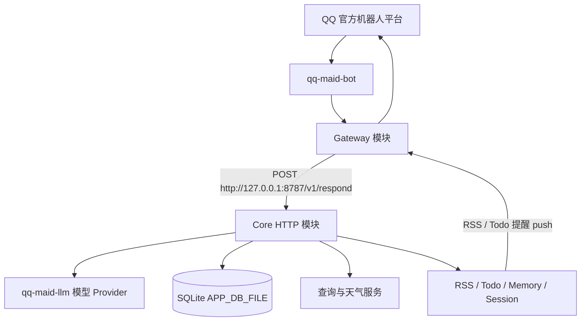

# QQ Maid Bot

[](CONTRIBUTING.md)
[](https://github.com/kuliantnt/qq-maid-bot/stargazers)

**一个会聊天、会记事，也会主动办事的自托管 QQ AI 助手。**

QQ Maid Bot 使用 Rust 构建，通过 QQ 官方机器人接口运行。它不只是把消息转发给大模型，而是将长期会话、受控记忆、Todo、RSS、知识检索、联网查询和主动推送整合进同一个长期在线的机器人中。

> Rust 单进程 · QQ 官方接口 · 受控长期记忆 · 主动推送 · 模型自动降级

## 项目亮点

### 🧠 不只是一次性聊天

会话可以新建、恢复、重命名和压缩，机器人能够持续维护上下文，而不是每条消息都从零开始。

长期记忆采用确认式流程：普通聊天不会偷偷写入记忆，只有用户明确提交并确认后才会保存。

### 📬 不只是等人发消息

内置 Todo、每日提醒、RSS / Atom 订阅和主动推送能力。

机器人既可以回答问题，也可以在任务到期、订阅更新时主动发送消息。

### 🛡️ 不把稳定性押在一个模型上

独立的 Rust LLM 层支持模型候选链、错误分类和自动降级。

当主模型或流式接口临时不可用时，可以根据配置尝试后备模型或兼容接口，而不是直接让整个机器人停止工作。

### 🦀 为长期在线运行而设计

运行时只需一个 `qq-maid-bot` 进程，主要业务状态统一保存在 SQLite。

项目提供部署脚本、服务控制、健康检查、链路诊断和运行日志，适合部署在个人服务器上持续运行。

## 它能做什么

| 场景    | 能力                                      |
| ----- | --------------------------------------- |
| 日常聊天  | 多轮会话、自动标题、上下文压缩和历史恢复                    |
| 长期记忆  | 生成记忆草稿，确认后保存，可查看和修改                     |
| 任务管理  | Todo 增删改查、每日提醒、火车行程校验                   |
| 信息订阅  | RSS / Atom 轮询、去重、翻译和主动推送                |
| 私人知识库 | 自动索引本地 Markdown，并按需注入相关内容               |
| 联网工具  | Web Search、天气、列车时刻和翻译                   |
| 模型调用  | Provider 路由、候选链、fallback、SSE 和 usage 观测 |
| 运维诊断  | `/healthz`、`/ping`、部署脚本和服务控制脚本             |

## 使用示例

```text
你：/todo add 明天下午三点检查服务器日志
机器人：已添加待办：检查服务器日志
        时间：明天 15:00

你：/rss add https://example.com/feed.xml Rust News
机器人：已添加订阅：Rust News

你：/memory 我习惯使用 Asia/Shanghai 时区
机器人：已生成长期记忆草稿，请确认后保存。

你：/查 今天 Rust 生态有什么值得关注的新闻
机器人：正在联网查询……
```

## 快速开始

```bash
git clone https://github.com/kuliantnt/qq-maid-bot.git
cd qq-maid-bot

cp runtime/.env.example runtime/config/.env
vim runtime/config/.env

bash scripts/deploy-local.sh
```

需要准备：

* QQ 官方机器人 AppID 和凭据
* 一个受支持的模型 Provider
* Linux 环境和基本命令行使用经验

部署完成后：

```bash
runtime/botctl.sh status     # 查看服务状态
runtime/botctl.sh health     # 查看 /healthz
runtime/botctl.sh logs       # 查看日志
```

完整配置和开发说明见 [开发文档](docs/DEVELOPMENT.md)。

## 运行表现

Gateway、Core 和 LLM 模块由同一个 `qq-maid-bot` 进程统一启动和管理。

一次实际群聊使用后的运行快照：

| 指标       |       结果 |
| -------- | -------: |
| 常驻内存 RSS | 约 24 MiB |
| 线程数      |        3 |
| 文件描述符    |       17 |
| Swap     |        0 |

该次运行快照中未发现异常的线程或文件描述符增长；约一小时的观察窗口内，内存占用保持在相近水平。

> 数据来自特定 Linux 环境下的实际运行快照，仅用于展示资源占用量级，不构成标准性能基准或长期稳定性保证。

## 架构概览



Core HTTP 层仅提供 `GET /healthz` 和 `POST /v1/respond` 两个服务端点。Gateway 负责 QQ 平台侧的消息收发，并为 RSS 调度与 Todo 每日提醒提供仅监听本机的 `/internal/push`。

项目内部通过根目录 Cargo Workspace 统一管理，保持明确的模块边界：

* `qq-maid-gateway-rs/` — QQ 事件接收、消息转换、回复发送、`/ping` 诊断
* `qq-maid-core/` — `/v1/respond`、业务 prompt、会话、记忆、Todo、RSS 和命令
* `qq-maid-llm/` — 模型协议、Provider 路由、fallback、SSE 和健康观测
* `qq-maid-common/` — 时间、日期和时区等共享基础工具

## 开发调试

开发或排查问题时，可以在前台启动：

```bash
make run
```

`make run` 以前台方式启动 `qq-maid-bot`，方便直接观察输出。模块说明见 [qq-maid-core/README.md](./qq-maid-core/README.md)。

## 常用指令

完整命令列表和用法见 [开发文档](docs/DEVELOPMENT.md)。常用指令速查：

<details>
<summary>展开</summary>

```text
/new 新话题
/resume          /恢复
/state           /状态
/compact

/memory 内容     /记忆 内容
/memory show 1
/memory edit 1 新内容

/todo add 明天下午检查日志
/todo             /待办
/todo done 1

/rss add https://example.com/feed.xml 示例订阅
/rss              /订阅

/查 今天的 Rust 新闻
/火车 G1
/天气杭州
/翻译日语 你好
```

</details>

## 项目状态

项目仍在持续开发，主要面向个人部署和开发者使用。

目前没有图形化管理后台，部署者需要具备基本的 Linux、命令行和 API 配置经验。QQ 官方机器人功能仍受平台权限、审核和接口规则限制。

## 版本升级

从 v0.3.x 升级到 v0.4.0 涉及单进程架构迁移，请先阅读 [CHANGELOG.md](./CHANGELOG.md#v040)。

## 配置和隐私提醒

* 不要提交 API Key、QQ AppSecret、Token、OpenID、群 ID、聊天记录或真实用户数据。
* 不要将真实 Prompt、Markdown 知识资料、成员映射、SQLite 数据库和日志提交到公开仓库。
* 公开仓库只提供 `.example` 模板，例如 [runtime/.env.example](./runtime/.env.example)。
* 私有配置和运行数据应放在仓库外，或放在被 `.gitignore` 忽略的目录中。
* 诊断和日志默认保持脱敏；临时开启 verbose 日志后，排障结束应关闭。

## Roadmap

* 完善安装向导、配置校验和故障诊断，降低首次部署成本。
* 持续补充 Gateway、LLM Provider、Todo、RSS 和持久化链路的测试覆盖。
* 改进本地知识检索、群聊交互和模型路由能力。
* 继续分离通用功能与私人配置，保持公开仓库可复用。

## ⭐ Star History

如果喜欢这个项目，请给个 Star ⭐

[](https://star-history.com/#kuliantnt/qq-maid-bot&Date)

## 文档导航

* 开发维护文档：[开发文档](docs/DEVELOPMENT.md)
* Core 模块文档：[qq-maid-core/README.md](./qq-maid-core/README.md)
* LLM 基础设施文档：[qq-maid-llm/README.md](./qq-maid-llm/README.md)
* Gateway 文档：[qq-maid-gateway-rs/README.md](./qq-maid-gateway-rs/README.md)
* 运行目录说明：[runtime/README.md](./runtime/README.md)
* 配置模板：[runtime/.env.example](./runtime/.env.example)
* Makefile：[Makefile](./Makefile)
* Issues：https://github.com/kuliantnt/qq-maid-bot/issues

## License

本项目基于 [MIT License](./LICENSE) 开源。
